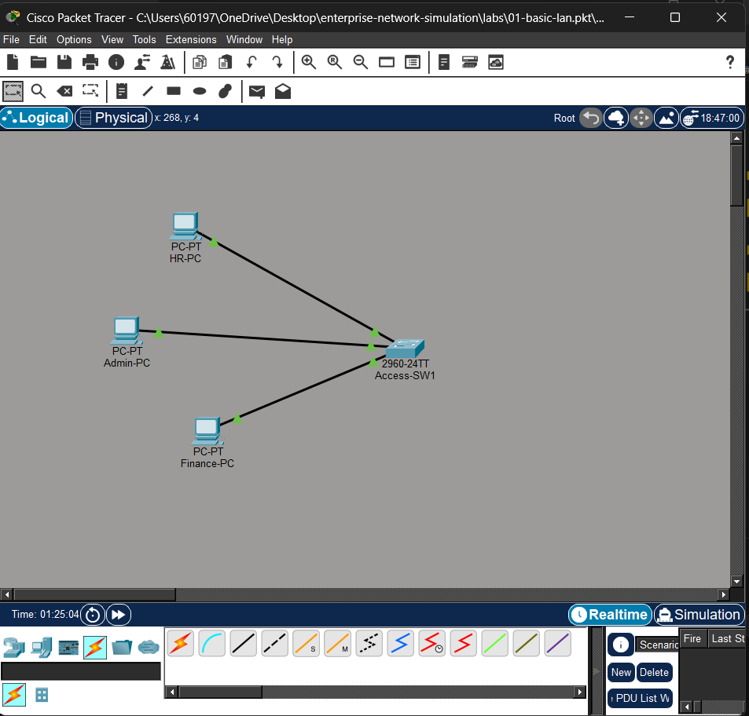
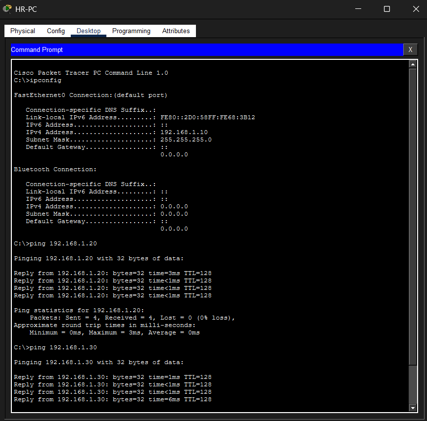
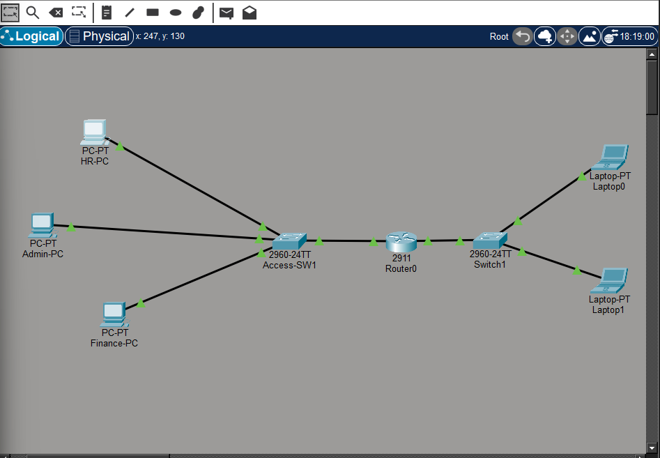
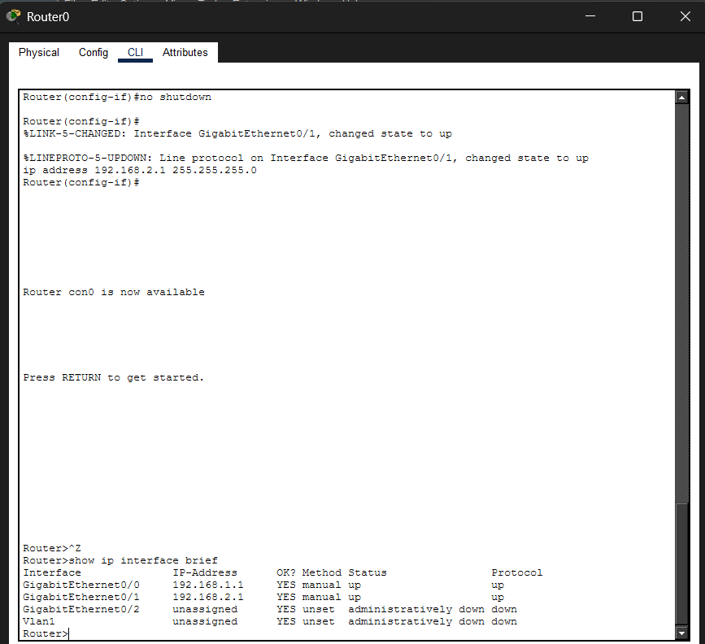
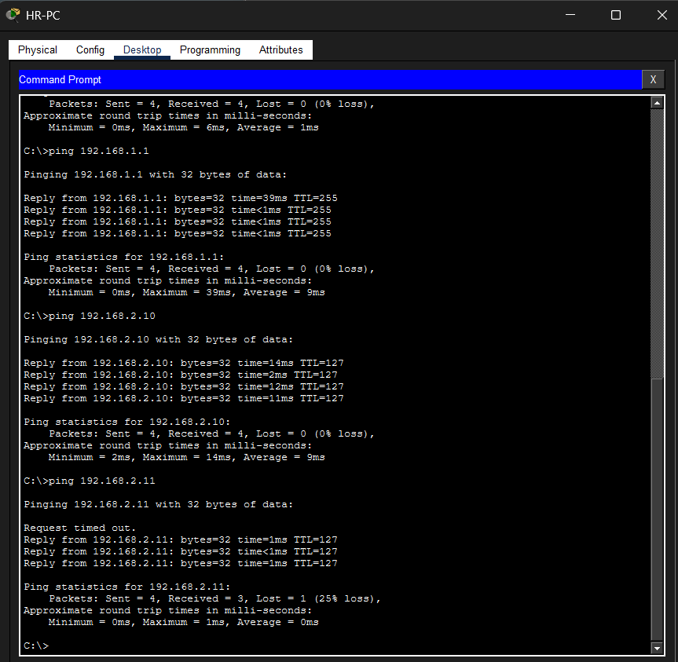
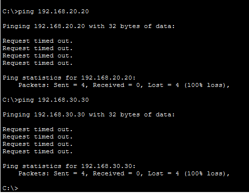
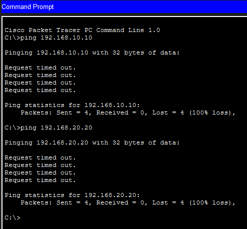

# Enterprise Network Simulation

This repository contains my hands-on networking labs using Cisco Packet Tracer.

---

## Lab 01 – Basic LAN

### Topology Diagram

### Ping Verification

### Topology
3 PCs connected to one Layer 2 switch (2960).

### IP Addressing
- HR-PC: 192.168.1.10 /24
- Admin-PC: 192.168.1.20 /24
- Finance-PC: 192.168.1.30 /24

### Verification
Successful ping between all PCs (0% packet loss).

### Skills Demonstrated
- Manual IP configuration
- Basic Layer 2 switching
- Network connectivity testing using ping

---

## Lab 02 – Inter-Network Routing (Router)

### Topology

### Router Interfaces

### Cross Network Ping

### Description

Two different networks were connected using a router.

Network A: 192.168.1.0/24
Gateway: 192.168.1.1

Network B: 192.168.2.0/24
Gateway: 192.168.2.1

Devices from both networks successfully communicated through routing.

---

## Lab 03 – VLAN Segmentation (Layer 2 Isolation)

Three departments were separated into different VLANs on the same switch.

| Department | VLAN | Network |
|---|---|---|
| HR | 10 | 192.168.10.0/24 |
| Admin | 20 | 192.168.20.0/24 |
| Finance | 30 | 192.168.30.0/24 |

### Verification — Inter-VLAN Traffic Blocked
All cross-VLAN communication failed as expected because no Layer 3 routing device was present.

#### VLAN10 (HR) cannot reach other departments

#### VLAN20 (Admin) cannot reach other departments

#### VLAN30 (Finance) cannot reach other departments

### Skills Demonstrated
- VLAN creation and port assignment
- Broadcast domain segmentation
- Layer 2 network isolation verification

Lab 03 progress – Inter-VLAN Routing (Router-on-a-Stick)

* Created VLAN 10 (ADMIN), VLAN 20 (HR), VLAN 30 (FINANCE)
* Assigned access ports Fa0/1–Fa0/3
* Configured trunk port Fa0/24 on switch
* Configured router subinterfaces with dot1Q encapsulation
* Troubleshooting connectivity (ARP/gateway issue)
* Preparing router model change (1941 → 2811) due to Packet Tracer compatibility

### Final Result

Inter-VLAN routing successfully implemented.

All VLAN networks can communicate through the router:

* VLAN10 (ADMIN) ↔ VLAN20 (HR)
* VLAN10 (ADMIN) ↔ VLAN30 (FINANCE)
* VLAN20 (HR) ↔ VLAN30 (FINANCE)

Verified using ICMP ping across different subnets.
